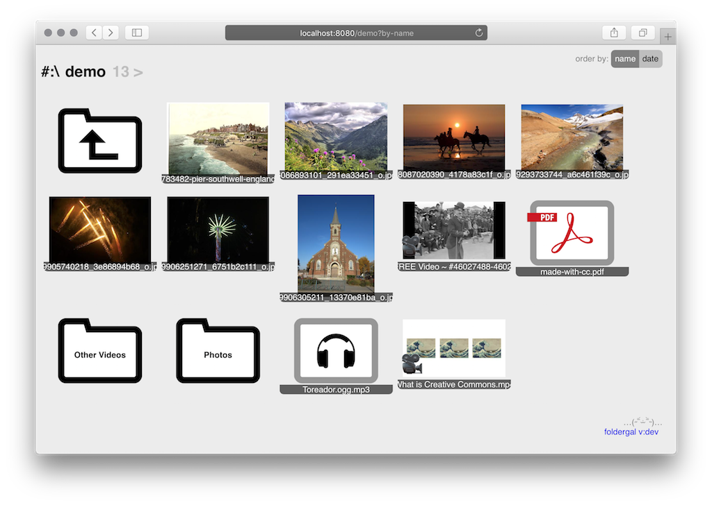

Web Gallery from a Folder
===

A web server that displays folders of images, video and audio.

Simple browsing of media files as web pages. Read only - no editing or uploading.
Limited only to the folder you want.

Produces a standalone executable. The only optional external 
dependency is `ffmpeg` for video thumbnails.

Optional support for TLS and http2.

Javascript is not needed to browse the web gallery. 
However some javascript is used when the overlay media on page feature is on.

Can work even on openwrt routers. But thumbnail generation is very slow there.

Has RSS/atom feed.

Optional Discord webhook for new uploads.



Usage
---

TLDR;
1. Run in terminal something like
   `./foldergal-binary --root /path/to/serve/files/from --home /tmp/foldergal`
2. Visit http://localhost:8080

### Configuration

#### Config File

`foldergal --config /path/to/config.json`

See config.default.json for details. Parameter names are case insensitive.

All settings in the config file override the env and cli parameters!

#### Environment variables and their defaults
```
export FOLDERGAL_CACHE_EXPIRES_AFTER=0
export FOLDERGAL_CONFIG=
export FOLDERGAL_DISCORD_NAME=Gallery
export FOLDERGAL_DISCORD_WEBHOOK=
export FOLDERGAL_HOME=.
export FOLDERGAL_HOST=localhost
export FOLDERGAL_HTTP2=false
export FOLDERGAL_NOTIFY_AFTER=30s
export FOLDERGAL_PORT=8080
export FOLDERGAL_PREFIX=
export FOLDERGAL_PUBLIC_HOST=
export FOLDERGAL_QUIET=false
export FOLDERGAL_ROOT=.
export FOLDERGAL_THUMB_H=400 
export FOLDERGAL_THUMB_W=400
export FOLDERGAL_TLS_CRT=
export FOLDERGAL_TLS_KEY=
```

#### Parameters

Run `./foldergal --help` for full info on command line parameters. 
They will override the env variables.

#### Home folder structure

* home (defaults to current folder)
  * `foldergal.log`
  * `_foldergal_cache/` (created automatically)
  
You can put config.json and tls certificates there but you will still have 
to point the executable to them.

Limitations and known issues
---

Privacy warning: all media is served as is, to the byte. 
This means that no EXIF or other metadata is removed from your files.

Http2 works only with TLS, which works only if you provide certificate files.

You should clean the "home" folder manually after using the application.
The thumnail cache and the log file remain on your disk.

In the rare case that you shared a folder from one volume (windows drive) and
later shared a folder with the same name but from different volume
you might see some erroneous thumbnails.

If you see an error stating "too many open files" you should set a larger 
file descriptor limit. Like running `ulimit -n 100000` in the current terminal.


Developer notes
---

1. `go generate`
1. `go build`
1. ... run

Use the [Makefile]().

Foldergal uses go modules.

Tested with go version 1.15.

When building use these flags to set the build time and version:
```
go build -ldflags="-X 'main.BuildTimestamp=TIME' -X 'main.BuildVersion=VERSION'"
```
Where TIME must be an RFC3339 string.

Package fsnotify requires `go get -u golang.org/x/sys/...`

Setting up service on Freebsd
---

1. copy somewehere the executable e.g. `/usr/local/bin/foldergal`
1. create a user to run the service e.g. `foldergaluser`
1. create the folder `/var/run/foldergal` and make the service user it's owner
1. create a file `/usr/local/etc/rc.d/foldergal` make sure it is executable
1. put there the contents of `example-rc-freebsd.sh` and edit
1. set the service user, correct paths, port, public name
1. add the line `foldergal_enable="yes"` in /etc/rc.conf
1. `service foldergal start`
1. you can check the logs in `FOLDERGAL_HOME` foldergal.log

Important: in order for file type detection to work you will need to have 
`/etc/mime-types` which freebsd does not have. 
One solution is to install apache and symlink to it's mime.types.
Ugly, yes, but foldergal will not see your videos otherwise.

Service on Debian
--

Create `/etc/systemd/system/foldergal.service` similar to 
`example-systemd.service`. Change paths, user and don't forget to 
edit your `config.json`.

After `sudo systemctl daemon-reload` you can `sudo service foldergal start`.

To enable auto-start: `sudo systemctl enable foldergal`

TODO
---

* [ ] Generate pdf thumbnails (imagemagick?)
* [x] Generate audio file thumbnails 
* [ ] In-browser notifications for new uploads
* [ ] 100% test coverage
* [ ] Use touch events for overlay media navigation
* [ ] Loading indicator for overlay image next and prev
* [ ] (maybe) Implement README.md parsing in folders (using https://github.com/yuin/goldmark)
* [ ] (maybe) Dynamic folder icons generated from the full folder path
* [ ] (maybe) Rework http server startup https://bojanz.github.io/increasing-http-server-boilerplate-go/
* [ ] Combine svg icons in a single file and `<use>` sprites 
* [ ] Fix misterious date bug 0001-01-01 on freebsd
* [x] Rewrite embedded files using the `go:embed` directive available in go 1.16
* [ ] Rewrite HTTP handlers using middleware e.g.
  https://eli.thegreenplace.net/2021/life-of-an-http-request-in-a-go-server/
* [ ] Exclude thumbs.db files
* [ ] (maybe) Use webauthn for authentication  
  https://github.com/duo-labs/webauthn
