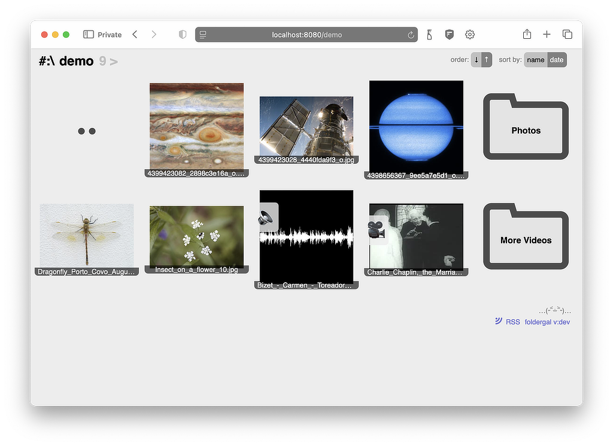

Web Gallery from a Folder
===

A web server that displays folders of images, video and audio.


Features
---

* __Limited scope__ - serves only media files from one folder 
  (images, audio, video and PDFs)
* __No editing__, no uploading - everything is read only
* __Usable with HTTP only__ - all javascript is optional
* __Portable__ - a single executable to run for a single website, available for 
  all major systems
* __Thumbnail generation__ - a frame from video files and full waveform for audio
  (requires ffmpeg installed)
* __Simple look__ - with light & dark theme support based on browser preferences
* __Content sorting__ - by file date or name
* __Shortcuts__ for navigation - (when using client JS) next/previous with keyboard 
  and touch swipe
* __RSS/atom feed__
* __Discord web-hook__ - notifications for new uploads
* __Cache in memory__ - (optional) to avoid reading from disk 
  when peaks in traffic happen
* Optional __TLS and http2__ - can be to exposed directly to the world
  as well as working behind a proxy server




Usage
---

TLDR;
1. Run in terminal
   `./foldergal --root /path/to/serve/files/from --home /tmp/foldergal`
2. Visit http://localhost:8080

### Configuration

#### Config File

`foldergal --config /path/to/config.json`

See config.default.json for details. Parameter names are case insensitive.

All settings in the config file override the env and cli parameters!

#### Environment variables and their defaults
```
export FOLDERGAL_CACHE_EXPIRES_AFTER=0
export FOLDERGAL_CONFIG=
export FOLDERGAL_DISCORD_NAME=Gallery
export FOLDERGAL_DISCORD_WEBHOOK=
export FOLDERGAL_HOME=.
export FOLDERGAL_HOST=localhost
export FOLDERGAL_HTTP2=false
export FOLDERGAL_NOTIFY_AFTER=30s
export FOLDERGAL_PORT=8080
export FOLDERGAL_PREFIX=
export FOLDERGAL_PUBLIC_HOST=
export FOLDERGAL_QUIET=false
export FOLDERGAL_ROOT=.
export FOLDERGAL_THUMB_H=400 
export FOLDERGAL_THUMB_W=400
export FOLDERGAL_TLS_CRT=
export FOLDERGAL_TLS_KEY=
```

#### Parameters

Run `./foldergal --help` for full info on command line parameters. 
They will override the env variables.

#### Home folder structure

* home (defaults to current folder)
  * `foldergal.log`
  * `_foldergal_cache/` (created automatically)
  
You can put config.json and TLS certificates there but you will still have 
to point the executable to them.


Limitations and known issues
---

Privacy notice: all media files are served directly. 
This means that no EXIF or other metadata is removed from your files.

Http2 works only with TLS, which works only if you provide certificate files.

The application writes thumbnails and log in the "home" folder. 
You should clean it manually if needed.

In the rare case that you used a folder from one mounted volume (windows drive) 
and later used a folder with the same name but from different volume
you might see some erroneous thumbnails.

If you see an error stating "too many open files" you should set a larger 
file descriptor limit. Like running `ulimit -n 100000`.


Developer notes
---

Just run with `go run ./cmd/foldergal/main.go`

Use the [Makefile](Makefile).


Setting up as a service on FreeBSD
---

1. copy the executable somewhere e.g. `/usr/local/bin/foldergal`
1. create a user to run the service e.g. `foldergaluser`
1. create the folder `/var/run/foldergal` and make the service user it's owner
1. create a file `/usr/local/etc/rc.d/foldergal` make sure it is executable
1. put there the contents of `example-rc-freebsd.sh` and edit
1. set the service user, correct paths, port, public name
1. add the line `foldergal_enable="yes"` in /etc/rc.conf
1. `service foldergal start`
1. you can check the logs in `FOLDERGAL_HOME` foldergal.log


Service on Debian
--

Create `/etc/systemd/system/foldergal.service` similar to 
`example-systemd.service`. Change paths, user and don't forget to 
edit your `config.json`.

After `sudo systemctl daemon-reload` you can `sudo service foldergal start`.

To enable auto-start: `sudo systemctl enable foldergal`


TODO List
---

* [x] Generate audio file thumbnails 
* [x] Use touch events (swipe left and right) for overlay media navigation
* [x] Loading indicator for overlay image next and prev
* [x] Hide loading background for media
* [x] Add dark theme support
* [x] Rewrite embedded files using the `go:embed` directive available in go 1.16
* [x] Fix consistency of sort flags
* [/] Combine SVG icons in a single file and `<use>` sprites 
* [ ] Generate pdf thumbnails (imagemagick?)
* [ ] 100% test coverage
* [ ] Add fuzz tests  
  <https://blog.fuzzbuzz.io/go-fuzzing-basics>
* [ ] (maybe) Implement README.md parsing in folders (using https://github.com/yuin/goldmark)
* [ ] (maybe) Dynamic folder icons generated from the full folder path
* [ ] (maybe) Rework http server startup https://bojanz.github.io/increasing-http-server-boilerplate-go/
* [ ] Fix mysterious date bug 0001-01-01 on freebsd
* [ ] Make sure thumbnail generation uses correct resizing
  <https://zuru.tech/blog/the-dangers-behind-image-resizing>
* [ ] Implement Adaptive Video (Multi Bitrate HLS)  
  Serve pre-generated bundles of video files. 
  Provide JS fallback for browsers not supporting HLS.
  - <https://github.com/bluenviron/gohlslib>
  - <https://medium.com/@peer5/creating-a-production-ready-multi-bitrate-hls-vod-stream-dff1e2f1612c>
  - fallback script <https://github.com/video-dev/hls.js>
* [ ] Use session without client javascript (JWT HttpOnly)
* [ ] (maybe) Use webauthn for authentication  
  <https://github.com/duo-labs/webauthn>
* [ ] Introduce folder metadata files
* [ ] Password protected folders (described in folder metadata and authenticated in session)
